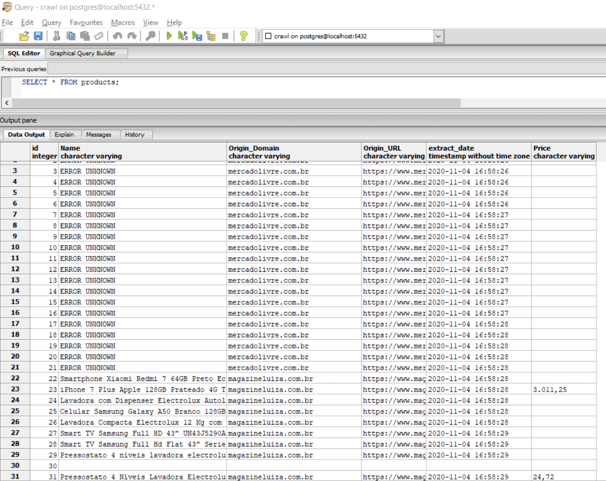

# product_crawlers
 Spider to crawl the products for Birdie

1. Git Clone

2. Install the dependencies (pip install -r requirements.txt)
 - Make sure to have PostgreSQL database installed.

3. Execute the crawler: 
    `scrapy crawl product_crawlers`

4. Check the Database:

## TODO:
 1. To understand why blank lines are being inserted
 2. To fix ML crawler.